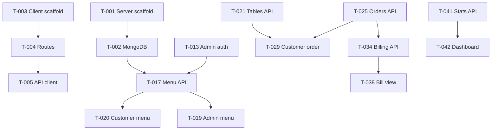

# Restaurant Management System — Task Plan

Master task list for building the MVP. Reference docs: [`architecture.MD`](architecture.MD), [`features.MD`](features.MD), [`.cursorrules`](.cursorrules).

**How to use:** Ask the agent to **"Execute T-017"** (or a range like **"Execute T-017 through T-020"**). The agent will implement the work and update this file — marking tasks `[~]` while in progress and `[x]` when complete.

---

## Progress Summary

| Status | Count |
|---|---|
| Total tasks | 46 |
| Done `[x]` | 7 |
| In progress `[~]` | 0 |
| Not started `[ ]` | 39 |

**Last updated:** 2026-06-28 (Batch 1 complete)

### Quick reference

| ID | Task | Status |
|---|---|---|
| T-001 | Server project scaffold | `[x]` |
| T-002 | MongoDB connection + health API | `[x]` |
| T-003 | Client project scaffold (Next.js, Tailwind, DaisyUI) | `[x]` |
| T-004 | Client App Router folder structure | `[x]` |
| T-005 | API client (`lib/api.js`) | `[x]` |
| T-006 | Shared constants (`lib/constants.js`) | `[x]` |
| T-007 | Root layout + global styles + theme | `[x]` |
| T-008 | Better Auth server config | `[ ]` |
| T-009 | Better Auth API route handler | `[ ]` |
| T-010 | Better Auth client | `[ ]` |
| T-011 | Login page | `[ ]` |
| T-012 | Dashboard layout + auth guard | `[ ]` |
| T-013 | Express admin auth middleware | `[ ]` |
| T-014 | Shared UI components | `[ ]` |
| T-015 | Public layout + navbar | `[ ]` |
| T-016 | Dashboard sidebar + shell | `[ ]` |
| T-017 | Menu API (CRUD) | `[ ]` |
| T-018 | Menu indexes on startup | `[ ]` |
| T-019 | Admin menu page | `[ ]` |
| T-020 | Customer menu page | `[ ]` |
| T-021 | Tables API | `[ ]` |
| T-022 | Tables indexes on startup | `[ ]` |
| T-023 | Admin tables page | `[ ]` |
| T-024 | TablePicker component | `[ ]` |
| T-025 | Orders API | `[ ]` |
| T-026 | Order status transitions + table updates | `[ ]` |
| T-027 | Orders indexes on startup | `[ ]` |
| T-028 | Admin orders page | `[ ]` |
| T-029 | Customer order page | `[ ]` |
| T-030 | Reservations API | `[ ]` |
| T-031 | Reservation status + table logic | `[ ]` |
| T-032 | Admin reservations page | `[ ]` |
| T-033 | Customer reserve page | `[ ]` |
| T-034 | Billing API | `[ ]` |
| T-035 | Bill generation + tax calculation | `[ ]` |
| T-036 | Bills indexes on startup | `[ ]` |
| T-037 | Admin billing page | `[ ]` |
| T-038 | Customer bill view page | `[ ]` |
| T-039 | Staff API | `[ ]` |
| T-040 | Admin staff page | `[ ]` |
| T-041 | Dashboard stats API | `[ ]` |
| T-042 | Dashboard overview page | `[ ]` |
| T-043 | Customer home page | `[ ]` |
| T-044 | Loading + error states | `[ ]` |
| T-045 | Mobile responsive pass | `[ ]` |
| T-046 | End-to-end smoke test checklist | `[ ]` |

---

## Status legend

| Mark | Meaning |
|---|---|
| `[ ]` | Not started |
| `[~]` | In progress |
| `[x]` | Done |

---

## Epic 0 — Project Foundation

### US-00: As a developer, I need the project scaffold so I can run server and client locally

#### T-001 — Server project scaffold `[x]`

**Sub-tasks**
- [x] Create `server/package.json` with express, mongodb, cors, dotenv
- [x] Create `server/index.js` with Express app, `express.json()`, CORS, listen on `PORT`
- [x] Add npm script `"start": "node index.js"` and `"dev"` if using nodemon

**Acceptance criteria**
- [x] `cd server && npm install && npm start` runs without error
- [x] Server listens on port 5000 (or `PORT` from env)
- [x] All code is plain JavaScript in a single `index.js` file

---

#### T-002 — MongoDB connection + health API `[x]`

**Sub-tasks**
- [x] Connect `MongoClient` using `MONGODB_URI` and `DB_NAME`
- [x] Add `GET /api/health` returning `{ status: "ok", db: "connected" }`
- [x] Handle connection errors gracefully

**Acceptance criteria**
- [x] Health endpoint returns 200 when MongoDB is reachable
- [x] Health endpoint returns 503 (or clear error) when DB is down
- [x] Connection uses native `mongodb` driver only (no Mongoose)

**Depends on:** T-001

---

#### T-003 — Client project scaffold `[x]`

**Sub-tasks**
- [x] Initialize Next.js app in `client/` (App Router, JavaScript, no TypeScript)
- [x] Install and configure Tailwind CSS
- [x] Install and configure DaisyUI plugin in `tailwind.config.js`
- [x] Verify `npm run dev` works

**Acceptance criteria**
- [x] `cd client && npm install && npm run dev` starts on port 3000
- [x] No `.ts` or `.tsx` files in the project
- [x] DaisyUI classes render correctly on a test element

---

#### T-004 — Client App Router folder structure `[x]`

**Sub-tasks**
- [x] Create route group `app/(public)/` with placeholder pages: `page.js`, `menu`, `order`, `reserve`, `bill/[id]`
- [x] Create `app/login/page.js`
- [x] Create route group `app/(dashboard)/dashboard/` with placeholders: `page.js`, `menu`, `tables`, `orders`, `reservations`, `billing`, `staff`
- [x] Create empty `components/ui`, `components/public`, `components/dashboard`, `lib/` folders

**Acceptance criteria**
- [x] All routes from [`features.MD`](features.MD) resolve without 404
- [x] Route groups do not affect URL paths (e.g. `/menu` not `/(public)/menu`)
- [x] Folder layout matches the structure documented in the project

**Depends on:** T-003

---

#### T-005 — API client (`lib/api.js`) `[x]`

**Sub-tasks**
- [x] Create fetch wrapper using `NEXT_PUBLIC_API_URL`
- [x] Support GET, POST, PATCH, DELETE helpers
- [x] Parse JSON responses; throw or return `{ error }` on failure
- [x] Optional auth header param for dashboard calls

**Acceptance criteria**
- [x] `api.get('/api/health')` works against running server
- [x] Errors surface a readable message from `{ error: "..." }` responses
- [x] Single file in `client/lib/api.js`

**Depends on:** T-002, T-004

---

#### T-006 — Shared constants (`lib/constants.js`) `[x]`

**Sub-tasks**
- [x] Define `ORDER_STATUSES`, `RESERVATION_STATUSES`, `TABLE_STATUSES`, `PAYMENT_STATUSES`
- [x] Define default menu `CATEGORIES` array
- [x] Export constants for use in components and forms

**Acceptance criteria**
- [x] Status values match [`features.MD`](features.MD) field definitions
- [x] Imported successfully from both server-facing and client components

**Depends on:** T-004

---

#### T-007 — Root layout + global styles + theme `[x]`

**Sub-tasks**
- [x] Create `app/layout.js` with `<html data-theme="corporate">` (or chosen theme)
- [x] Create `app/globals.css` with Tailwind directives
- [x] Set page title and basic metadata

**Acceptance criteria**
- [x] Every page inherits DaisyUI theme
- [x] Tailwind utility classes work app-wide
- [x] Layout is valid App Router root layout

**Depends on:** T-003

---

## Epic 1 — Authentication

### US-A01: As staff, I want to log in so I can access the admin dashboard

#### T-008 — Better Auth server config `[ ]`

**Sub-tasks**
- [ ] Install Better Auth in client project
- [ ] Create `lib/auth.js` with email/password provider
- [ ] Configure session settings for Next.js App Router

**Acceptance criteria**
- [ ] Auth instance exports from `lib/auth.js`
- [ ] Configuration is JavaScript only
- [ ] `.env.local` variables documented in comments (user must confirm before writing `.env`)

**Depends on:** T-004

---

#### T-009 — Better Auth API route handler `[ ]`

**Sub-tasks**
- [ ] Create `app/api/auth/[...all]/route.js` wired to Better Auth handler

**Acceptance criteria**
- [ ] Auth endpoints respond at `/api/auth/*`
- [ ] Sign-up/sign-in routes reachable (even if sign-up is disabled for production)

**Depends on:** T-008

---

#### T-010 — Better Auth client `[ ]`

**Sub-tasks**
- [ ] Create `lib/auth-client.js` for client components
- [ ] Export signIn, signOut, useSession (or equivalent)

**Acceptance criteria**
- [ ] Client components can call signIn/signOut without errors
- [ ] Session state available for conditional UI

**Depends on:** T-008, T-009

---

#### T-011 — Login page `[ ]`

**Sub-tasks**
- [ ] Build `/login` with email + password form (DaisyUI `input`, `btn`)
- [ ] Redirect to `/dashboard` on successful login
- [ ] Show error alert on failed login

**Acceptance criteria**
- [ ] Valid credentials redirect to `/dashboard`
- [ ] Invalid credentials show DaisyUI `alert alert-error`
- [ ] Page is accessible without prior auth

**Depends on:** T-010, T-007

---

#### T-012 — Dashboard layout + auth guard `[ ]`

**Sub-tasks**
- [ ] Create `app/(dashboard)/layout.js` checking session server-side
- [ ] Redirect unauthenticated users to `/login`
- [ ] Render children inside dashboard shell placeholder

**Acceptance criteria**
- [ ] Visiting `/dashboard/*` without session redirects to `/login`
- [ ] Authenticated users see dashboard content
- [ ] Logout clears session (wired in T-016)

**Depends on:** T-011

---

#### T-013 — Express admin auth middleware `[ ]`

**Sub-tasks**
- [ ] Add middleware in `server/index.js` to verify admin session on protected routes
- [ ] Return 401 for unauthenticated admin mutations
- [ ] Allow public routes (menu read, orders POST, etc.) without auth

**Acceptance criteria**
- [ ] Protected POST/PATCH/DELETE return 401 without valid session
- [ ] Public GET endpoints remain accessible
- [ ] Auth check lives in `index.js` (no separate middleware files required, inline function is fine)

**Depends on:** T-002, T-009

---

## Epic 2 — Shared UI Shell

### US-00: As a user, I want consistent navigation and layout across the app

#### T-014 — Shared UI components `[ ]`

**Sub-tasks**
- [ ] `components/ui/PageHeader.js`
- [ ] `components/ui/DataTable.js`
- [ ] `components/ui/StatusBadge.js`
- [ ] `components/ui/LoadingSpinner.js`
- [ ] `components/ui/EmptyState.js`

**Acceptance criteria**
- [ ] Components use DaisyUI classes only (no custom CSS files)
- [ ] `StatusBadge` supports order, table, reservation, and payment statuses
- [ ] `DataTable` supports headers, rows, and `overflow-x-auto` for mobile

**Depends on:** T-007

---

#### T-015 — Public layout + navbar `[ ]`

**Sub-tasks**
- [ ] Create `app/(public)/layout.js`
- [ ] Create `components/public/PublicNavbar.js` with links: Home, Menu, Order, Reserve
- [ ] Add simple footer

**Acceptance criteria**
- [ ] All public pages share navbar and footer
- [ ] Navbar links route correctly
- [ ] Layout is mobile-friendly (collapsible or stacked links)

**Depends on:** T-004, T-014

---

#### T-016 — Dashboard sidebar + shell `[ ]`

**Sub-tasks**
- [ ] Create `components/dashboard/Sidebar.js` with nav: Dashboard, Menu, Tables, Orders, Reservations, Billing, Staff
- [ ] Create `components/dashboard/DashboardNavbar.js` with logout button
- [ ] Wire sidebar into `(dashboard)/layout.js`

**Acceptance criteria**
- [ ] All dashboard routes accessible from sidebar
- [ ] Active route highlighted
- [ ] Logout returns user to `/login`

**Depends on:** T-012, T-014

---

## Epic 3 — Menu

### US-C01: As a customer, I want to browse the menu so I can decide what to order

### US-A03: As a manager, I want to manage menu items so the catalog stays up to date

#### T-017 — Menu API (CRUD) `[ ]`

**Sub-tasks**
- [ ] `GET /api/menu-items` — public, list all (optional filter `?available=true`)
- [ ] `POST /api/menu-items` — admin, create item
- [ ] `PATCH /api/menu-items/:id` — admin, update item
- [ ] `DELETE /api/menu-items/:id` — admin, delete item
- [ ] Validate required fields: name, price, category; reject negative price

**Acceptance criteria**
- [ ] CRUD works via curl or API client
- [ ] Invalid body returns 400 with `{ error: "..." }`
- [ ] Admin routes require auth (T-013)

**Depends on:** T-002, T-013

---

#### T-018 — Menu indexes on startup `[ ]`

**Sub-tasks**
- [ ] Create indexes on `menuItems`: `{ category: 1 }`, `{ available: 1 }`

**Acceptance criteria**
- [ ] Indexes created idempotently on server start (ignore if exists)

**Depends on:** T-017

---

#### T-019 — Admin menu page `[ ]`

**Sub-tasks**
- [ ] Build `/dashboard/menu` with DataTable listing all items
- [ ] Create `components/dashboard/MenuItemForm.js` for add/edit modal
- [ ] Toggle `available`, delete with confirmation

**Acceptance criteria**
- [ ] Manager/admin can create, edit, delete menu items
- [ ] Table shows name, category, price, available badge
- [ ] Form validation errors shown inline

**Depends on:** T-005, T-016, T-017

---

#### T-020 — Customer menu page `[ ]`

**Sub-tasks**
- [ ] Build `/menu` grouped by category
- [ ] Create `components/public/MenuCard.js` and `MenuCategorySection.js`
- [ ] Hide or grey out unavailable items
- [ ] Link to `/order`

**Acceptance criteria**
- [ ] Items grouped by category from API
- [ ] Prices and descriptions display correctly
- [ ] "Order now" navigates to `/order`
- [ ] Page works on mobile

**Depends on:** T-015, T-017

---

## Epic 4 — Tables

### US-C02: As a customer, I want to pick an available table when placing an order

### US-A04: As staff, I want to manage tables and see floor status

#### T-021 — Tables API `[ ]`

**Sub-tasks**
- [ ] `GET /api/tables` — admin, list all
- [ ] `GET /api/tables/available` — public, filter `status: "available"`
- [ ] `POST /api/tables` — admin, create (number, capacity)
- [ ] `PATCH /api/tables/:id` — admin, update number/capacity/status
- [ ] Enforce unique table `number`

**Acceptance criteria**
- [ ] Available endpoint returns only `available` tables
- [ ] Duplicate table number returns 400
- [ ] Status values restricted to `available | occupied | reserved`

**Depends on:** T-002, T-013

---

#### T-022 — Tables indexes on startup `[ ]`

**Sub-tasks**
- [ ] Unique index on `tables.number`

**Acceptance criteria**
- [ ] Index created on server start

**Depends on:** T-021

---

#### T-023 — Admin tables page `[ ]`

**Sub-tasks**
- [ ] Build `/dashboard/tables`
- [ ] Create `components/dashboard/TableGrid.js` showing number, capacity, status badge
- [ ] Add table form; manual status override dropdown

**Acceptance criteria**
- [ ] All tables visible with status badges
- [ ] Admin can add table and change status
- [ ] Summary counts shown (available / occupied / reserved)

**Depends on:** T-016, T-021

---

#### T-024 — TablePicker component `[ ]`

**Sub-tasks**
- [ ] Create `components/public/TablePicker.js`
- [ ] Fetch available tables; show number and capacity
- [ ] Emit selected `tableId` to parent form

**Acceptance criteria**
- [ ] Only available tables listed
- [ ] Selection state clear to user
- [ ] Reusable on `/order` page

**Depends on:** T-021

---

## Epic 5 — Orders

### US-C02: As a customer, I want to place an order at my table

### US-W01: As a waiter, I want to track and update order status

#### T-025 — Orders API `[ ]`

**Sub-tasks**
- [ ] `GET /api/orders` — admin, list with optional `?status=` filter
- [ ] `POST /api/orders` — public, create order (tableId, items[], optional customerName, notes)
- [ ] `PATCH /api/orders/:id` — admin, update order fields
- [ ] `PATCH /api/orders/:id/status` — admin, advance status
- [ ] Snapshot item name and price from `menuItems` on create; compute subtotal

**Acceptance criteria**
- [ ] Order stores item price snapshot (immune to later menu edits)
- [ ] Creating order sets linked table to `occupied`
- [ ] Invalid tableId or empty items returns 400

**Depends on:** T-017, T-021, T-013

---

#### T-026 — Order status transitions + table updates `[ ]`

**Sub-tasks**
- [ ] Define valid transitions in `index.js`: pending → preparing → served → billed → paid
- [ ] Reject invalid status jumps with 400
- [ ] On transition to `paid`, set table to `available`

**Acceptance criteria**
- [ ] Cannot skip statuses (e.g. pending → served)
- [ ] Status constants match `lib/constants.js`
- [ ] Table freed only when order reaches `paid`

**Depends on:** T-025

---

#### T-027 — Orders indexes on startup `[ ]`

**Sub-tasks**
- [ ] Index on `{ status: 1, createdAt: -1 }`

**Acceptance criteria**
- [ ] Index created on server start

**Depends on:** T-025

---

#### T-028 — Admin orders page `[ ]`

**Sub-tasks**
- [ ] Build `/dashboard/orders` with filter tabs or dropdown by status
- [ ] Create `components/dashboard/OrderList.js` with advance-status action
- [ ] Show table number, items summary, subtotal, status badge

**Acceptance criteria**
- [ ] Staff can filter orders by status
- [ ] One-click (or dropdown) status advance works
- [ ] Link to generate bill when status is `served` (wired in T-037)

**Depends on:** T-016, T-025, T-026

---

#### T-029 — Customer order page `[ ]`

**Sub-tasks**
- [ ] Build `/order` multi-step or single-page flow
- [ ] Create `components/public/OrderCart.js` (add/remove items, qty)
- [ ] Integrate TablePicker; submit to POST /api/orders
- [ ] Success screen with order summary

**Acceptance criteria**
- [ ] User selects table, adds menu items, submits order
- [ ] Success shows table number and order id
- [ ] Validation: cannot submit empty cart or no table
- [ ] Error alerts on API failure

**Depends on:** T-020, T-024, T-025

---

## Epic 6 — Reservations

### US-C03: As a customer, I want to book a table in advance

### US-A06: As a manager, I want to confirm and manage reservations

#### T-030 — Reservations API `[ ]`

**Sub-tasks**
- [ ] `GET /api/reservations` — admin, list with optional date/status filter
- [ ] `POST /api/reservations` — public, create (customerName, phone, partySize, dateTime, notes)
- [ ] `PATCH /api/reservations/:id` — admin, update status / assign tableId
- [ ] New reservations default to `pending`

**Acceptance criteria**
- [ ] Public POST creates pending reservation only
- [ ] Required field validation on create
- [ ] Admin PATCH can set status and tableId

**Depends on:** T-002, T-013

---

#### T-031 — Reservation status + table logic `[ ]`

**Sub-tasks**
- [ ] On confirm: set status `confirmed`, assign tableId, set table `reserved`
- [ ] Validate partySize ≤ table capacity on confirm
- [ ] On cancel: set status `cancelled`, release table to `available`
- [ ] On seated: set status `seated`

**Acceptance criteria**
- [ ] Confirm without valid table returns 400
- [ ] Cancel releases reserved table
- [ ] Status transitions match [`features.MD`](features.MD)

**Depends on:** T-030, T-021

---

#### T-032 — Admin reservations page `[ ]`

**Sub-tasks**
- [ ] Build `/dashboard/reservations`
- [ ] Create `components/dashboard/ReservationList.js`
- [ ] Actions: confirm (with table picker), cancel, mark seated

**Acceptance criteria**
- [ ] List shows customer, phone, party size, dateTime, status
- [ ] Confirm opens table assignment (capacity check surfaced)
- [ ] Filters by date or status

**Depends on:** T-016, T-030, T-031

---

#### T-033 — Customer reserve page `[ ]`

**Sub-tasks**
- [ ] Build `/reserve`
- [ ] Create `components/public/ReservationForm.js`
- [ ] Submit to POST /api/reservations; show success message

**Acceptance criteria**
- [ ] Form collects name, phone, party size, date, time, optional notes
- [ ] Success message explains confirmation is pending
- [ ] Validation errors displayed with DaisyUI alerts

**Depends on:** T-015, T-030

---

## Epic 7 — Billing

### US-C04: As a customer, I want to view my bill

### US-W02: As a waiter, I want to generate bills and record payment

#### T-034 — Billing API `[ ]`

**Sub-tasks**
- [ ] `GET /api/bills` — admin, list with optional paymentStatus filter
- [ ] `GET /api/bills/:id` — public, single bill
- [ ] `POST /api/bills` — admin, create from orderId
- [ ] `PATCH /api/bills/:id/pay` — admin, mark paid

**Acceptance criteria**
- [ ] One bill per order (duplicate POST returns 400)
- [ ] Public can view bill by id
- [ ] Admin routes require auth

**Depends on:** T-025, T-013

---

#### T-035 — Bill generation + tax calculation `[ ]`

**Sub-tasks**
- [ ] Only allow bill creation when order status is `served`
- [ ] Copy line items from order; compute subtotal, tax (`TAX_RATE` constant), total
- [ ] On create: set order status to `billed`
- [ ] On pay: set paymentStatus `paid`, order status `paid`, table `available`, set `paidAt`

**Acceptance criteria**
- [ ] Tax and total calculated correctly
- [ ] Full chain served → billed → paid → table available works
- [ ] `TAX_RATE` defined in `server/index.js`

**Depends on:** T-034, T-026

---

#### T-036 — Bills indexes on startup `[ ]`

**Sub-tasks**
- [ ] Unique index on `bills.orderId`
- [ ] Index on `{ paymentStatus: 1 }`

**Acceptance criteria**
- [ ] Indexes created on server start

**Depends on:** T-034

---

#### T-037 — Admin billing page `[ ]`

**Sub-tasks**
- [ ] Build `/dashboard/billing`
- [ ] Create `components/dashboard/BillList.js`
- [ ] Actions: generate bill (from served orders), mark paid
- [ ] Filter unpaid / paid

**Acceptance criteria**
- [ ] Unpaid bills listed with total and table/order ref
- [ ] Generate bill action available for served orders without bill
- [ ] Mark paid updates list without page reload (or refreshes data)

**Depends on:** T-016, T-034, T-035

---

#### T-038 — Customer bill view page `[ ]`

**Sub-tasks**
- [ ] Build `/bill/[id]`
- [ ] Create `components/public/BillSummary.js`
- [ ] Show line items, subtotal, tax, total, payment status (read-only)

**Acceptance criteria**
- [ ] Valid bill id renders full summary
- [ ] Invalid id shows friendly error / EmptyState
- [ ] Payment status clearly indicated (paid vs unpaid)

**Depends on:** T-015, T-034

---

## Epic 8 — Staff & Dashboard

### US-A02: As admin, I want a dashboard overview of today's operations

### US-A08: As admin, I want to manage staff records

#### T-039 — Staff API `[ ]`

**Sub-tasks**
- [ ] `GET /api/staff` — admin, list all
- [ ] `POST /api/staff` — admin, create (name, email, role, active)
- [ ] `PATCH /api/staff/:id` — admin, update fields
- [ ] Enforce unique email; roles: admin, manager, waiter

**Acceptance criteria**
- [ ] CRUD works for admin user
- [ ] Duplicate email returns 400
- [ ] Deactivate via `active: false` (no hard delete required)

**Depends on:** T-013

---

#### T-040 — Admin staff page `[ ]`

**Sub-tasks**
- [ ] Build `/dashboard/staff`
- [ ] Create `components/dashboard/StaffForm.js` for add/edit
- [ ] Show role badge and active status

**Acceptance criteria**
- [ ] Admin can add, edit, deactivate staff
- [ ] Role displayed as badge (admin / manager / waiter)
- [ ] Non-admin users blocked (when role checks added later)

**Depends on:** T-016, T-039

---

#### T-041 — Dashboard stats API `[ ]`

**Sub-tasks**
- [ ] `GET /api/dashboard/stats` — admin
- [ ] Return: openOrdersCount, todayReservationsCount, unpaidBillsCount, todayRevenue

**Acceptance criteria**
- [ ] Counts accurate against live data
- [ ] `todayRevenue` sums `paid` bills created today
- [ ] Requires admin auth

**Depends on:** T-025, T-030, T-034, T-013

---

#### T-042 — Dashboard overview page `[ ]`

**Sub-tasks**
- [ ] Build `/dashboard` (overview)
- [ ] Create `components/dashboard/StatCard.js`
- [ ] Show recent pending orders and upcoming reservations lists

**Acceptance criteria**
- [ ] Four stat cards populated from stats API
- [ ] Quick-link or short lists for actionable items
- [ ] Loads with loading spinner; errors show alert

**Depends on:** T-016, T-041

---

## Epic 9 — Home & Polish

### US-C05: As a customer, I want a welcoming home page that guides me to key actions

#### T-043 — Customer home page `[ ]`

**Sub-tasks**
- [ ] Build `/` with restaurant name, welcome copy
- [ ] Action cards linking to Menu, Order, Reserve
- [ ] Optional: fetch and show 3 featured available menu items

**Acceptance criteria**
- [ ] Clear calls-to-action for all three customer flows
- [ ] Consistent with public layout navbar
- [ ] Mobile-friendly card grid

**Depends on:** T-015, T-020 (optional featured items)

---

#### T-044 — Loading + error states `[ ]`

**Sub-tasks**
- [ ] Add `loading.js` for heavy dashboard pages (orders, reservations, billing)
- [ ] Add `error.js` for dashboard route group or key pages
- [ ] Ensure customer forms show API errors via alerts

**Acceptance criteria**
- [ ] No blank screens during data fetch
- [ ] Errors human-readable, not raw stack traces
- [ ] LoadingSpinner or DaisyUI skeleton used consistently

**Depends on:** All page tasks

---

#### T-045 — Mobile responsive pass `[ ]`

**Sub-tasks**
- [ ] Verify all tables use `overflow-x-auto`
- [ ] Sidebar collapses to drawer or top nav on small screens
- [ ] Forms and cards stack vertically on mobile

**Acceptance criteria**
- [ ] Usable at 375px viewport width
- [ ] No horizontal page overflow on customer pages
- [ ] Dashboard navigable on tablet and phone

**Depends on:** All page tasks

---

#### T-046 — End-to-end smoke test checklist `[ ]`

**Sub-tasks**
- [ ] Document manual test script in this file (see below)
- [ ] Run full flow: menu → order → serve → bill → pay → table free
- [ ] Run reservation flow: request → confirm → seated
- [ ] Verify auth blocks unauthenticated dashboard access

**Acceptance criteria**
- [ ] All smoke tests pass locally
- [ ] Checklist appended to this document under **Smoke Tests**
- [ ] Any failures filed as follow-up notes in **Blockers**

**Depends on:** T-001 through T-045

---

## Dependency graph (simplified)

**Recommended execution order:** T-001 → T-007 → T-008 → T-013 → T-014 → T-016 → T-017 → T-020 → T-021 → T-025 → T-029 → T-030 → T-033 → T-034 → T-038 → T-039 → T-041 → T-043 → T-044 → T-046

---

## Smoke tests (complete when T-046 is done)

| # | Steps | Pass |
|---|---|---|
| S-1 | Open `/menu` — items load by category | `[ ]` |
| S-2 | Open `/order` — pick table, add items, submit — table becomes occupied | `[ ]` |
| S-3 | `/dashboard/orders` — advance order to served | `[ ]` |
| S-4 | `/dashboard/billing` — generate bill, mark paid — table available | `[ ]` |
| S-5 | Open `/bill/[id]` — bill displays correctly | `[ ]` |
| S-6 | `/reserve` — submit reservation — appears as pending in dashboard | `[ ]` |
| S-7 | Confirm reservation with table — table becomes reserved | `[ ]` |
| S-8 | `/login` — auth required for `/dashboard/*` | `[ ]` |
| S-9 | `/dashboard/staff` — CRUD staff record | `[ ]` |
| S-10 | `/dashboard` — stats match current data | `[ ]` |

---

## Blockers & notes

| Date | Task | Note |
|---|---|---|
| — | — | No blockers yet |

---

## Post-MVP backlog (not numbered — out of scope for v1)

- Role-based UI per Waiter/Manager matrix ([`features.MD`](features.MD) §2)
- Link `staff.email` to Better Auth user ids
- Customer accounts and order history
- Email/SMS reservation confirmations
- Payment gateway integration
- Kitchen display view for `preparing` orders

---

## Agent instructions (for task execution)

When the user says **"Execute T-0XX"**:

1. Mark T-0XX as `[~]` in this file (Progress Summary + task heading).
2. Read dependencies — complete them first if still `[ ]`.
3. Implement per acceptance criteria and [`.cursorrules`](.cursorrules).
4. Mark all sub-task checkboxes and acceptance criteria `[x]` when met.
5. Mark T-0XX as `[x]`; update Progress Summary counts and **Last updated** date.
6. If blocked, leave `[~]`, add a row to **Blockers & notes**.
