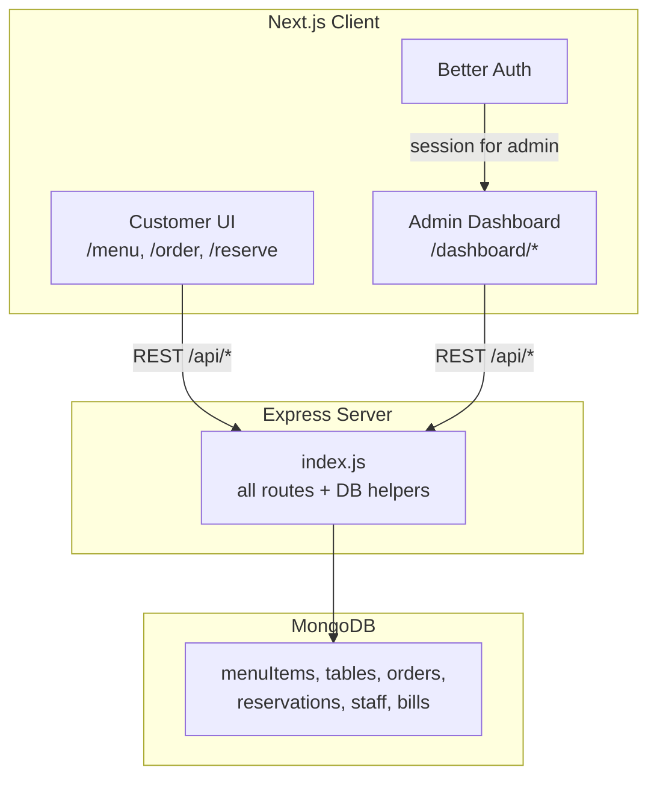
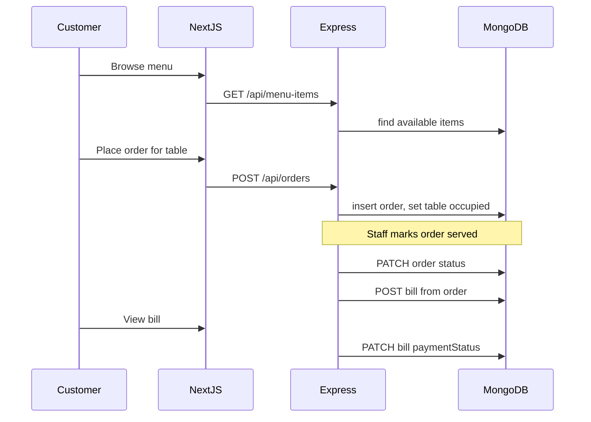

# Restaurant Management System — Architecture

This document describes the high-level architecture for the restaurant management system. For coding conventions and stack constraints, see [`.cursorrules`](.cursorrules).

---

## 1. Overview and Goals

The system supports day-to-day restaurant operations: menu management, table layout, order handling, reservations, staff records, and billing. It serves two audiences:

- **Customers** — browse the menu, place orders, book tables, and view bills (no account required).
- **Staff / Admin** — manage all resources and monitor activity through a protected dashboard.

**Design principle:** keep it simple. One Express file for the API, one Next.js app with two UI zones (public customer pages and a protected admin dashboard), and MongoDB accessed via the native driver (no Mongoose, no MVC split).

---

## 2. High-Level Architecture



| Layer | Technology | Notes |
|---|---|---|
| Frontend | Next.js (App Router), JavaScript | Tailwind CSS + DaisyUI |
| Auth | Better Auth | Admin dashboard only |
| Backend | Node.js + Express | Single file: `server/index.js` |
| Database | MongoDB | Official `mongodb` driver |

---

## 3. Repository Layout

```
restaurent-management/
├── server/
│   ├── index.js              # Express app, routes, DB helpers
│   ├── package.json
│   └── .env
├── client/
│   ├── app/
│   │   ├── (public)/         # Customer-facing pages
│   │   ├── (dashboard)/      # Admin pages (auth-protected)
│   │   ├── login/            # Admin login
│   │   └── api/auth/         # Better Auth handlers
│   ├── components/           # Shared UI components
│   ├── lib/
│   │   ├── api.js            # Fetch wrapper to Express
│   │   └── auth.js           # Better Auth config
│   ├── package.json
│   └── .env.local
├── architecture.MD
└── .cursorrules
```

`server/` and `client/` are separate Node projects with their own `package.json` files.

---

## 4. Backend Architecture

All backend logic lives in **`server/index.js`**. There is no MVC folder structure — no separate controllers, models, or route files.

### Responsibilities in `index.js`

1. Express app setup and middleware (`express.json`, CORS)
2. MongoDB connection via `MongoClient`
3. Small inline helpers (`getCollection`, `toObjectId`, `sendError`)
4. All REST route handlers grouped by domain

### API Conventions

- Base path: `/api`
- JSON request and response bodies
- Error shape: `{ "error": "message" }` with appropriate HTTP status codes
- Validate required fields in route handlers; return `400` for bad input

### Auth Boundary

| Access | Endpoints |
|---|---|
| Public (read) | `GET /api/menu-items`, `GET /api/tables/available` |
| Public (write) | `POST /api/orders`, `POST /api/reservations` (validated input) |
| Admin only | All create/update/delete for menu, tables, staff; order status changes; bill generation; dashboard stats |

Admin routes verify a Better Auth session before processing mutations.

---

## 5. Data Model

MongoDB collections use camelCase plural names. Documents are plain JavaScript objects — no ODM or schemas.

### Collections

| Collection | Purpose | Key Fields |
|---|---|---|
| `menuItems` | Food and drink catalog | `name`, `description`, `price`, `category`, `available` |
| `tables` | Floor layout | `number`, `capacity`, `status` |
| `orders` | Customer and staff orders | `tableId`, `items[]`, `status`, `subtotal`, `createdAt` |
| `reservations` | Table bookings | `customerName`, `phone`, `partySize`, `dateTime`, `tableId`, `status` |
| `staff` | Employee records | `name`, `role`, `email`, `active` |
| `bills` | Billing linked to orders | `orderId`, `lineItems[]`, `subtotal`, `tax`, `total`, `paymentStatus`, `paidAt` |

### Field Details

**`menuItems`**
```json
{
  "name": "Margherita Pizza",
  "description": "Tomato, mozzarella, basil",
  "price": 14.99,
  "category": "Mains",
  "available": true
}
```

**`tables`** — `status`: `available` | `occupied` | `reserved`

**`orders`** — `items[]` embeds a price snapshot at order time:
```json
{
  "tableId": "<ObjectId>",
  "items": [
    { "menuItemId": "<ObjectId>", "name": "Margherita Pizza", "qty": 2, "price": 14.99 }
  ],
  "status": "pending",
  "subtotal": 29.98,
  "createdAt": "2026-06-28T12:00:00Z"
}
```

**`orders.status`**: `pending` → `preparing` → `served` → `billed` → `paid`

**`reservations.status`**: `pending` → `confirmed` → `seated` | `cancelled`

**`bills.paymentStatus`**: `unpaid` | `paid`

### Relationships

- **Order → Table** — order references `tableId`; creating an order sets the table to `occupied`.
- **Bill → Order** — one bill per order; created when the order is ready to pay.
- **Reservation → Table** — optional `tableId`; confirming a reservation sets the table to `reserved`.

No separate `customers` collection in v1. Guest name and phone are stored inline on orders and reservations.

---

## 6. Core Workflows

### Order Flow



1. Customer selects items and submits an order for a table.
2. Order starts as `pending`; staff advances it to `preparing`, then `served`.
3. Staff generates a bill from the order (`POST /api/bills`).
4. Payment is recorded manually (`PATCH /api/bills/:id/pay`); table returns to `available`.

### Reservation Flow

1. Customer submits a reservation (name, phone, party size, date/time).
2. Admin confirms and optionally assigns a table → table status becomes `reserved`.
3. When the party arrives, staff marks the reservation as `seated` (may create an order).
4. Cancelled reservations release the table back to `available`.

### Table Status Flow

```
available  ←→  occupied   (order placed / order paid)
available  ←→  reserved   (reservation confirmed / cancelled or seated)
```

---

## 7. API Endpoints

All routes are defined in `server/index.js`.

### Menu

| Method | Path | Access | Description |
|---|---|---|---|
| GET | `/api/menu-items` | Public | List menu items |
| POST | `/api/menu-items` | Admin | Create item |
| PATCH | `/api/menu-items/:id` | Admin | Update item |
| DELETE | `/api/menu-items/:id` | Admin | Delete item |

### Tables

| Method | Path | Access | Description |
|---|---|---|---|
| GET | `/api/tables` | Admin | List all tables |
| GET | `/api/tables/available` | Public | List available tables |
| POST | `/api/tables` | Admin | Add table |
| PATCH | `/api/tables/:id` | Admin | Update table / status |

### Orders

| Method | Path | Access | Description |
|---|---|---|---|
| GET | `/api/orders` | Admin | List orders (filter by status) |
| POST | `/api/orders` | Public | Create order |
| PATCH | `/api/orders/:id` | Admin | Update order |
| PATCH | `/api/orders/:id/status` | Admin | Advance order status |

### Reservations

| Method | Path | Access | Description |
|---|---|---|---|
| GET | `/api/reservations` | Admin | List reservations |
| POST | `/api/reservations` | Public | Create reservation |
| PATCH | `/api/reservations/:id` | Admin | Confirm, seat, or cancel |

### Staff

| Method | Path | Access | Description |
|---|---|---|---|
| GET | `/api/staff` | Admin | List staff |
| POST | `/api/staff` | Admin | Add staff member |
| PATCH | `/api/staff/:id` | Admin | Update staff member |

### Billing

| Method | Path | Access | Description |
|---|---|---|---|
| GET | `/api/bills` | Admin | List bills |
| GET | `/api/bills/:id` | Public | View a bill (by ID) |
| POST | `/api/bills` | Admin | Generate bill from order |
| PATCH | `/api/bills/:id/pay` | Admin | Mark bill as paid |

### Dashboard

| Method | Path | Access | Description |
|---|---|---|---|
| GET | `/api/dashboard/stats` | Admin | Open orders, today's reservations, revenue summary |

---

## 8. Frontend Architecture

One Next.js app hosts two UI zones.

### Customer UI (Public)

| Route | Purpose |
|---|---|
| `/` | Landing page with links to menu, order, reserve |
| `/menu` | Browse available menu items by category |
| `/order` | Select table, add items, submit order |
| `/reserve` | Book a table (date, time, party size) |
| `/bill/[id]` | View bill details and payment status |

No login required. Uses DaisyUI cards and grids for a clean, mobile-friendly layout.

### Admin Dashboard (Protected)

| Route | Purpose |
|---|---|
| `/login` | Admin sign-in via Better Auth |
| `/dashboard` | Overview stats (open orders, reservations, revenue) |
| `/dashboard/menu` | CRUD for menu items |
| `/dashboard/tables` | Manage tables and floor status |
| `/dashboard/orders` | View and update order statuses |
| `/dashboard/reservations` | Manage bookings |
| `/dashboard/staff` | Manage staff records |
| `/dashboard/billing` | Generate and mark bills as paid |

The `(dashboard)` route group shares a layout with a sidebar (`Dashboard`, `Menu`, `Orders`, `Tables`, `Reservations`, `Staff`, `Billing`). Unauthenticated users are redirected to `/login`.

### Shared Frontend Pieces

| File | Role |
|---|---|
| `client/lib/api.js` | Fetch wrapper; base URL from `NEXT_PUBLIC_API_URL` |
| `client/lib/auth.js` | Better Auth server config |
| `client/components/Sidebar.js` | Admin navigation |
| `client/components/DataTable.js` | Reusable list/table view |
| `client/components/StatusBadge.js` | Order, table, and payment status badges |
| `client/components/PageHeader.js` | Consistent page titles and actions |

Use DaisyUI components (`btn`, `card`, `table`, `modal`, `badge`, `alert`) with a consistent theme (e.g. `data-theme="corporate"`). Tables use `overflow-x-auto` for mobile.

---

## 9. Authentication and Authorization

- **Better Auth** handles admin login (email/password) in the Next.js app.
- Auth handlers live under `client/app/api/auth/`.
- The dashboard layout checks the session and redirects to `/login` if absent.
- Staff records include a `role` field (`admin`, `manager`, `waiter`) as an extension point; v1 starts with a single admin role.
- Customer pages are fully public — no account or session needed.

---

## 10. Environment and Deployment

### Server (`server/.env`)

| Variable | Description |
|---|---|
| `PORT` | Server port (default `5000`) |
| `MONGODB_URI` | MongoDB connection string |
| `DB_NAME` | Database name |
| `CLIENT_URL` | Next.js origin for CORS |

### Client (`client/.env.local`)

| Variable | Description |
|---|---|
| `NEXT_PUBLIC_API_URL` | Express API base URL (e.g. `http://localhost:5000`) |
| Better Auth vars | As required by Better Auth setup |

### Local Development

```bash
# Terminal 1 — API
cd server && npm install && node index.js

# Terminal 2 — Frontend
cd client && npm install && npm run dev
```

Server runs on port 5000; Next.js dev server on port 3000.

### Deployment (Brief)

- **MongoDB Atlas** for the database.
- **Express server** on a VPS or platform (Railway, Render, etc.).
- **Next.js client** on Vercel or similar.
- Set `CLIENT_URL` and `NEXT_PUBLIC_API_URL` to production URLs.

---

## 11. Out of Scope (v1)

The following are intentionally excluded to keep the system simple:

- Payment gateway integration (Stripe, etc.) — bills are marked `paid` manually
- Real-time updates / WebSockets / kitchen display system
- Inventory and ingredient tracking
- Multi-location or franchise support
- Customer accounts and order history
- TypeScript, Mongoose, or backend MVC architecture

---

## 12. Feature Implementation Order

When building out the system, follow this sequence:

1. **Server scaffold** — Express + MongoDB connection in `index.js`
2. **Menu + Tables** — foundational data admin and customer can browse
3. **Orders** — customer order flow and admin status management
4. **Reservations** — public booking and admin confirmation
5. **Billing** — bill generation from orders and payment tracking
6. **Staff + Dashboard stats** — staff CRUD and overview metrics
7. **Customer UI polish** — responsive layout, loading states, error alerts

For each feature: add the API route in `server/index.js` first, then build the corresponding admin and customer pages.
