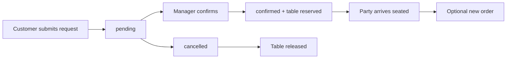
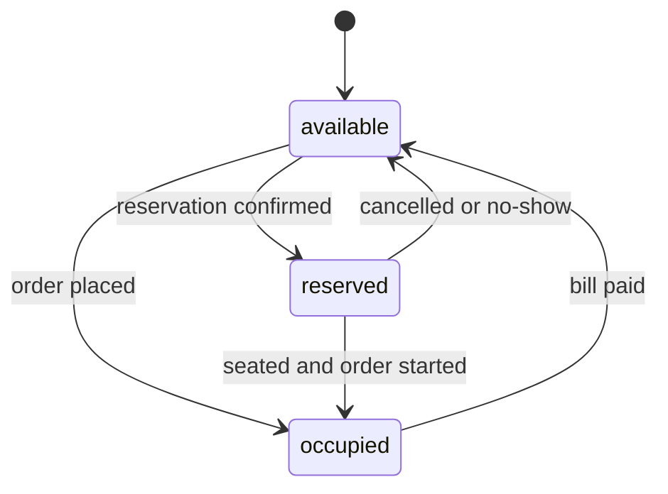

# Restaurant Management System — Feature List

Product-focused breakdown of pages, user roles, main flows, and MongoDB collection fields. For system architecture and API details, see [`architecture.MD`](architecture.MD). For coding rules, see [`.cursorrules`](.cursorrules).

No schema or validation files in v1 — fields are documented here and enforced inline in `server/index.js` route handlers.

---

## 1. Feature Summary

| # | Feature | Customer UI | Admin Dashboard | Primary Collection(s) |
|---|---|---|---|---|
| F1 | Menu | Browse items | CRUD menu | `menuItems` |
| F2 | Tables | See availability (for order/reserve) | Manage floor layout & status | `tables` |
| F3 | Orders | Place order at a table | Track and update order lifecycle | `orders`, `tables` |
| F4 | Reservations | Request a booking | Confirm, assign table, seat/cancel | `reservations`, `tables` |
| F5 | Billing | View bill by link/ID | Generate bills, mark paid | `bills`, `orders` |
| F6 | Staff | — | Manage staff records | `staff` |
| F7 | Dashboard | — | Overview stats and quick links | reads all collections |

---

## 2. User Roles

Three staff roles are defined on the `staff` collection. Customers are unauthenticated guests — not a stored role.

### Customer (Guest)

- No login, no account
- Can browse menu, place orders, request reservations, view a bill if they have the bill ID/link
- Cannot access `/dashboard/*` or admin API mutations

### Waiter

- Logs in via Better Auth (linked to a `staff` record)
- View and update **orders** (status changes)
- View **tables** and update table status when seating or clearing
- View **reservations** and mark as seated
- Generate **bills** and mark as paid
- View **menu** (read-only)
- Cannot manage menu CRUD, staff, or delete records

### Manager

- Everything a Waiter can do, plus:
- Full **menu** CRUD
- Full **tables** CRUD
- Full **reservations** management (confirm, cancel, assign table)
- View **dashboard** stats
- Cannot manage **staff** accounts

### Admin

- Full access to all dashboard pages and admin API endpoints
- **Staff** CRUD
- All Manager and Waiter permissions

### Role × Page Access Matrix

| Page | Customer | Waiter | Manager | Admin |
|---|---|---|---|---|
| `/` | Yes | Yes | Yes | Yes |
| `/menu` | Yes | Yes | Yes | Yes |
| `/order` | Yes | Yes | Yes | Yes |
| `/reserve` | Yes | Yes | Yes | Yes |
| `/bill/[id]` | Yes | Yes | Yes | Yes |
| `/login` | Yes | Yes | Yes | Yes |
| `/dashboard` | No | Yes | Yes | Yes |
| `/dashboard/menu` | No | Read | Full | Full |
| `/dashboard/tables` | No | Update status | Full | Full |
| `/dashboard/orders` | No | Full | Full | Full |
| `/dashboard/reservations` | No | Seat only | Full | Full |
| `/dashboard/billing` | No | Full | Full | Full |
| `/dashboard/staff` | No | No | No | Full |

**v1 simplification:** implement Admin-only auth first; add Waiter/Manager role checks when staff login is wired to `staff.role`.

---

## 3. Pages

### 3.1 Customer UI (Public)

#### `/` — Home

- Restaurant name, short welcome message
- Cards or buttons linking to Menu, Order, Reserve
- Optional: today's featured items (from available `menuItems`)

#### `/menu` — Menu Browser

- List items grouped by `category` (Starters, Mains, Drinks, Desserts, etc.)
- Show name, description, price; hide or grey out unavailable items
- "Order now" link to `/order` (optional: pass category filter)
- Read-only; data from `GET /api/menu-items`

#### `/order` — Place Order

- Step 1: Select an **available** table (`GET /api/tables/available`)
- Step 2: Add items from menu (qty per item)
- Step 3: Optional guest name / note
- Submit → `POST /api/orders`
- Success screen: order summary, table number, status `pending`

#### `/reserve` — Make Reservation

- Form: customer name, phone, party size, preferred date & time
- Optional: special requests (notes)
- Submit → `POST /api/reservations` with status `pending`
- Success screen: confirmation message ("we'll confirm shortly")

#### `/bill/[id]` — View Bill

- Fetch `GET /api/bills/:id`
- Show line items, subtotal, tax, total, payment status
- Read-only for customer; staff marks paid from dashboard

---

### 3.2 Admin UI (Protected)

All routes under `/dashboard/*` require Better Auth session. Shared layout: sidebar nav + top bar with logout.

#### `/login` — Staff Login

- Email + password via Better Auth
- Redirect to `/dashboard` on success

#### `/dashboard` — Overview

- Stat cards: open orders count, today's reservations, unpaid bills, today's revenue
- Quick lists: recent pending orders, upcoming reservations
- Data from `GET /api/dashboard/stats`

#### `/dashboard/menu` — Menu Management

- Table of all menu items with category, price, available toggle
- Add / Edit modal: name, description, price, category, available
- Delete with confirmation
- Manager+ only for write actions

#### `/dashboard/tables` — Table Management

- Grid or table: table number, capacity, current status badge
- Add table (number, capacity)
- Manual status override (e.g. mark available after cleaning)
- Visual floor summary: count by status (available / occupied / reserved)

#### `/dashboard/orders` — Order Management

- Filterable list by status (`pending`, `preparing`, `served`, `billed`, `paid`)
- Row actions: advance status, view items, link to bill
- Optional: create order on behalf of customer (staff-assisted)
- Status badges via shared `StatusBadge` component

#### `/dashboard/reservations` — Reservation Management

- List/filter by date and status
- Actions: confirm (+ assign `tableId`), cancel, mark seated
- Confirming sets linked table to `reserved`
- Seating sets reservation to `seated` and may prompt to start an order

#### `/dashboard/billing` — Billing

- List bills: order ref, total, payment status, date
- Action: generate bill from a `served` order (`POST /api/bills`)
- Action: mark as paid (`PATCH /api/bills/:id/pay`) → updates order to `paid`, table to `available`
- Filter: unpaid / paid

#### `/dashboard/staff` — Staff Management

- List staff: name, role, email, active
- Add / edit / deactivate (soft via `active: false`)
- Admin only
- `email` should match Better Auth user for login linkage (future)

---

## 4. Main Flows

### 4.1 Dine-In Order Flow (Primary)

```mermaid
flowchart LR
  A[Customer browses menu] --> B[Selects table + items]
  B --> C[POST order pending]
  C --> D[Table occupied]
  D --> E[Staff preparing]
  E --> F[Staff served]
  F --> G[Staff generates bill]
  G --> H[Customer views bill]
  H --> I[Staff marks paid]
  I --> J[Table available]
```

| Step | Actor | Action | Data Change |
|---|---|---|---|
| 1 | Customer | Browse `/menu` | — |
| 2 | Customer | Submit order on `/order` | `orders` insert, `tables.status` → `occupied` |
| 3 | Waiter | Set order → `preparing` | `orders.status` |
| 4 | Waiter | Set order → `served` | `orders.status` |
| 5 | Waiter | Generate bill | `bills` insert, `orders.status` → `billed` |
| 6 | Customer | View `/bill/[id]` | — |
| 7 | Waiter | Mark bill paid | `bills.paymentStatus` → `paid`, `orders.status` → `paid`, `tables.status` → `available` |

**Order status lifecycle:** `pending` → `preparing` → `served` → `billed` → `paid`

---

### 4.2 Reservation Flow

| Step | Actor | Action | Data Change |
|---|---|---|---|
| 1 | Customer | Submit `/reserve` form | `reservations` insert, status `pending` |
| 2 | Manager | Confirm, assign table | status `confirmed`, `tableId` set, `tables.status` → `reserved` |
| 3 | Waiter | Mark seated | status `seated`, may create `orders` |
| Alt | Manager | Cancel | status `cancelled`, table → `available` if was reserved |

**Reservation status lifecycle:** `pending` → `confirmed` → `seated` | `cancelled`

---

### 4.3 Table Status Flow

---

### 4.4 Admin Day-Start Flow (Operational)

1. Manager reviews `/dashboard` — open orders, today's reservations
2. Confirm pending reservations and assign tables
3. Waiters monitor `/dashboard/orders` during service
4. End of shift: ensure unpaid bills are cleared, tables set to `available`

---

## 5. MongoDB Collections — Field Discussion

Plain JavaScript documents stored via the native `mongodb` driver. `_id` is ObjectId on every document. Timestamps use ISO 8601 strings or `Date` objects — pick one convention in `index.js` and stay consistent.

### 5.1 `menuItems`

| Field | Type | Required | Notes |
|---|---|---|---|
| `_id` | ObjectId | auto | Primary key |
| `name` | string | yes | Display name, e.g. "Margherita Pizza" |
| `description` | string | no | Short description for menu page |
| `price` | number | yes | Store in main currency unit (e.g. 14.99), not cents |
| `category` | string | yes | Groups items on `/menu` — e.g. Starters, Mains, Drinks, Desserts |
| `available` | boolean | yes | `false` hides or greys out item; default `true` |
| `createdAt` | Date/string | yes | Set on insert |
| `updatedAt` | Date/string | no | Set on update |

**Indexes (when needed):** `category`, `available`

**Validation in routes:** reject negative price; trim name; require non-empty category.

---

### 5.2 `tables`

| Field | Type | Required | Notes |
|---|---|---|---|
| `_id` | ObjectId | auto | Referenced by orders and reservations |
| `number` | number | yes | Display number shown to customers (unique) |
| `capacity` | number | yes | Max guests; used when matching reservations |
| `status` | string | yes | `available` \| `occupied` \| `reserved` |
| `createdAt` | Date/string | yes | Set on insert |

**Indexes:** unique on `number`

**Business rules:**
- Only `available` tables appear in `/order` table picker
- Status updated by order/reservation flows or manual admin override
- Do not delete a table with active orders; deactivate pattern not needed in v1 — keep delete admin-only with check

---

### 5.3 `orders`

| Field | Type | Required | Notes |
|---|---|---|---|
| `_id` | ObjectId | auto | |
| `tableId` | ObjectId | yes | Reference to `tables._id` |
| `tableNumber` | number | no | Denormalized snapshot for display without join |
| `items` | array | yes | Embedded line items (see below) |
| `status` | string | yes | `pending` \| `preparing` \| `served` \| `billed` \| `paid` |
| `subtotal` | number | yes | Sum of item line totals at order time |
| `customerName` | string | no | Optional guest name |
| `notes` | string | no | Special instructions |
| `createdAt` | Date/string | yes | |
| `updatedAt` | Date/string | no | |

**Embedded `items[]` element:**

| Field | Type | Notes |
|---|---|---|
| `menuItemId` | ObjectId | Original menu reference |
| `name` | string | Snapshot — menu name at order time |
| `qty` | number | Quantity ordered |
| `price` | number | Unit price snapshot |
| `lineTotal` | number | Optional; `qty * price` for clarity |

**Why snapshot items?** Menu prices and names can change later; the order record must stay accurate for billing.

**Indexes:** `status`, `tableId`, `createdAt`

---

### 5.4 `reservations`

| Field | Type | Required | Notes |
|---|---|---|---|
| `_id` | ObjectId | auto | |
| `customerName` | string | yes | |
| `phone` | string | yes | Contact for confirmation |
| `partySize` | number | yes | Must be ≤ table `capacity` when table assigned |
| `dateTime` | Date/string | yes | Requested date and time |
| `tableId` | ObjectId | no | Assigned on confirm |
| `status` | string | yes | `pending` \| `confirmed` \| `seated` \| `cancelled` |
| `notes` | string | no | Special requests |
| `createdAt` | Date/string | yes | |

**Indexes:** `dateTime`, `status`

**Business rules:**
- Public POST creates `pending` only
- Manager assigns `tableId` on confirm; validate capacity
- Cancelling releases table if status was `confirmed`

---

### 5.5 `bills`

| Field | Type | Required | Notes |
|---|---|---|---|
| `_id` | ObjectId | auto | Used in `/bill/[id]` URL |
| `orderId` | ObjectId | yes | One bill per order in v1 |
| `tableNumber` | number | no | Denormalized for display |
| `lineItems` | array | yes | Copy from order items or recompute |
| `subtotal` | number | yes | From order |
| `taxRate` | number | no | e.g. 0.08 for 8%; default in server constant |
| `tax` | number | yes | `subtotal * taxRate` |
| `total` | number | yes | `subtotal + tax` |
| `paymentStatus` | string | yes | `unpaid` \| `paid` |
| `paidAt` | Date/string | no | Set when marked paid |
| `createdAt` | Date/string | yes | |

**Indexes:** `orderId` (unique), `paymentStatus`, `createdAt`

**Business rules:**
- Only create bill when order is `served`
- Marking paid updates order to `paid` and table to `available`
- No payment gateway — cash/card recorded manually

---

### 5.6 `staff`

| Field | Type | Required | Notes |
|---|---|---|---|
| `_id` | ObjectId | auto | |
| `name` | string | yes | Display name |
| `email` | string | yes | Login email; should match Better Auth user |
| `role` | string | yes | `admin` \| `manager` \| `waiter` |
| `active` | boolean | yes | `false` disables access checks |
| `createdAt` | Date/string | yes | |

**Indexes:** unique on `email`

**Note:** Better Auth stores credentials separately. `staff` is the app's role record — link by `email` until a tighter `authUserId` field is added later.

---

## 6. Cross-Cutting Concerns

### Authentication

- Better Auth on Next.js for staff only
- Express validates admin session on protected routes (token/cookie forwarded from client)
- Customer routes need no auth

### Error & Feedback UI

- Customer pages: DaisyUI `alert` for form errors and success toasts
- Dashboard: inline validation messages, loading skeletons on tables

### API Client

- `client/lib/api.js` — single fetch helper with base URL and optional auth headers for dashboard calls

### Suggested Indexes (apply in `index.js` on startup)

| Collection | Index |
|---|---|
| `menuItems` | `{ category: 1 }`, `{ available: 1 }` |
| `tables` | `{ number: 1 }` unique |
| `orders` | `{ status: 1, createdAt: -1 }` |
| `reservations` | `{ dateTime: 1, status: 1 }` |
| `bills` | `{ orderId: 1 }` unique, `{ paymentStatus: 1 }` |
| `staff` | `{ email: 1 }` unique |

### Constants (inline in `server/index.js`)

- `TAX_RATE` — default tax percentage for bills
- `ORDER_STATUSES` — allowed status values and valid transitions
- `RESERVATION_STATUSES` — allowed values and transitions
- `TABLE_STATUSES` — allowed values

---

## 7. MVP vs Later

### MVP (build first)

- Customer: menu, order, reserve, view bill
- Admin: full dashboard with Admin-only auth
- All six collections with fields above
- Manual bill payment

### Later (not v1)

- Role-based UI hiding per Waiter/Manager matrix
- `authUserId` on `staff` linked to Better Auth
- Customer accounts and order history
- Email/SMS reservation confirmations
- Payment gateway on `/bill/[id]`
- Kitchen display view for `preparing` orders

---

## 8. Build Order (Feature → Pages → API)

| Phase | Feature | Pages | API routes in `index.js` |
|---|---|---|---|
| 1 | Scaffold | `/login`, `/dashboard` shell | health check, DB connect |
| 2 | Menu | `/menu`, `/dashboard/menu` | `/api/menu-items` CRUD |
| 3 | Tables | `/order` (table pick), `/dashboard/tables` | `/api/tables` CRUD, `/available` |
| 4 | Orders | `/order`, `/dashboard/orders` | `/api/orders` CRUD, status |
| 5 | Reservations | `/reserve`, `/dashboard/reservations` | `/api/reservations` |
| 6 | Billing | `/bill/[id]`, `/dashboard/billing` | `/api/bills` |
| 7 | Staff & stats | `/dashboard/staff`, `/dashboard` | `/api/staff`, `/api/dashboard/stats` |
| 8 | Home & polish | `/` | — |

For each phase: backend route first, then admin page, then customer page if applicable.
